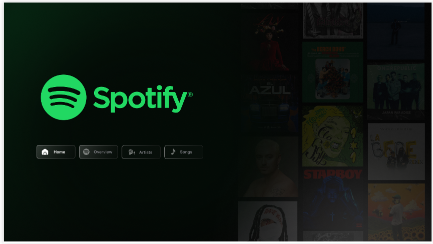
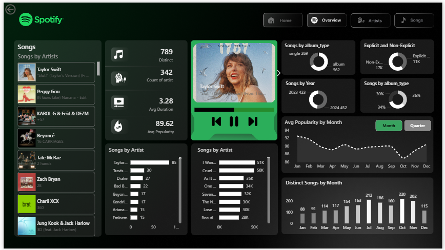
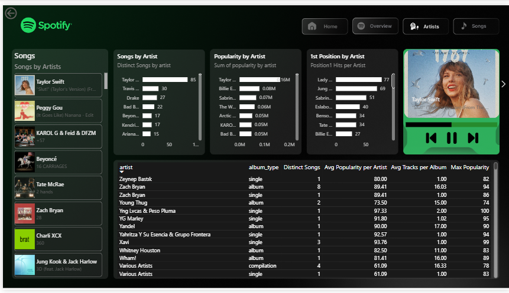
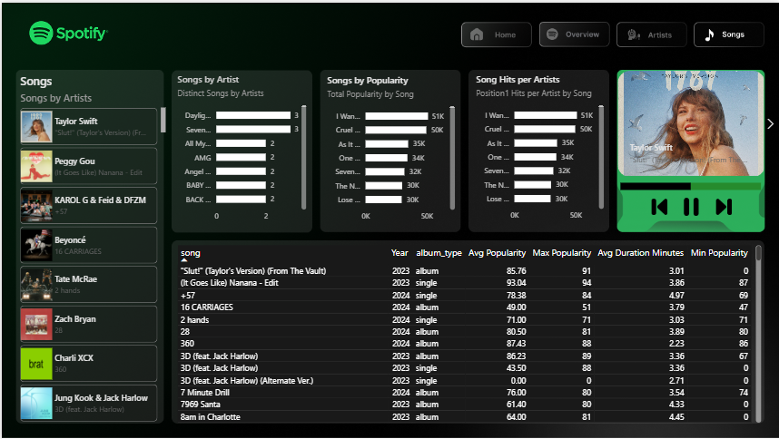

# 🎵 Spotify Top 50 World Dashboard

This is a Power BI dashboard that shows data from the Spotify Top 50 World list. It's built to look clean and easy to use.

---

### 🔄 How to use it
The dashboard has 4 main parts:
**Home Page ➔ Overall Stats ➔ Artist Info ➔ Song Details**

---

## 🖥️ Dashboard Slideshow

<b>🏠 Home Page</b>

 

<b>📊 Global Overview</b>

 

<b>👩‍🎤 Artist Analysis</b>

 

<b>🎵 Song Specifics</b>

 

---

## 🚀 What's inside?

- **Easy Navigation**: You can easily jump between the Home, Overview, Artist, and Song pages.
- **Filters**: You can filter the data by Artist or Song to see what you want.
- **Cool Design**: I used a dark theme with custom icons to make it look like the real Spotify app.
- **Song Data**: Shows which songs are popular and explains why based on the data.

## 📊 What did I find?

- **Top Artists**: See which artists have the most hits in the Top 50.
- **Song Stats**: Check out how long songs are and how popular they got.
- **Music Trends**: Look at what makes a song become a hit.

## 🛠️ Tools Used

- **Power BI**: To make the charts and the dashboard.
- **Excel/CSV**: This is where the data came from.
- **DAX**: Used some simple formulas to calculate the stats.

---

## 📂 Files in this project

- `Spotify_Analysis_Dashboard.pbix`: The main Power BI file.
- `spotify-top-50-world.csv`: The data file.
- `assets/`: Contains the screenshots, backgrounds, and icons used in the dashboard.

## 📖 How to open it

1. Download the `.pbix` file.
2. Open it with **Power BI Desktop**.
3. If it asks for the data, just select the `.csv` file in this folder.

---
*Created for my portfolio.*
